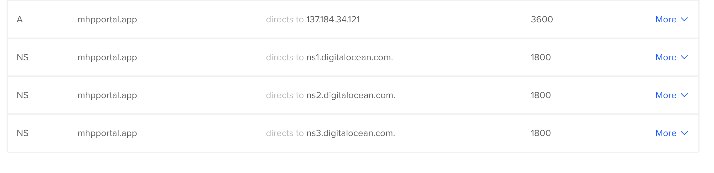

# Instructions/Gotchas for Digital Ocean 

## Digtal Ocean Droplet Specifications
Currently using:
 * Ubuntu Docker 19.03.12 on Ubuntu 20.04 Droplet
 * 2 vCPUs
 * 4GB / 80GB Disk


## Domains 
Tie to Droplet & Add MX DNS Records for GMAIL compatibility


## Add `oh-my-zsh`

For most up-to-date instructions: https://github.com/ohmyzsh/ohmyzsh

Run the following scripts to install ZSH and oh-my-zsh, powerlevel9k. 
```shell
apt install zsh
sh -c "$(wget -O- https://raw.githubusercontent.com/ohmyzsh/ohmyzsh/master/tools/install.sh)"
git clone https://github.com/bhilburn/powerlevel9k.git ~/.oh-my-zsh/custom/themes/powerlevel9k
git clone https://github.com/zsh-users/zsh-autosuggestions ${ZSH_CUSTOM:-~/.oh-my-zsh/custom}/plugins/zsh-autosuggestions
git clone https://github.com/zsh-users/zsh-syntax-highlighting.git ${ZSH_CUSTOM:-~/.oh-my-zsh/custom}/plugins/zsh-syntax-highlighting
```
From this directory
```shell
cp .zshrc ~/.zshrc
source ~/.zshrc
```