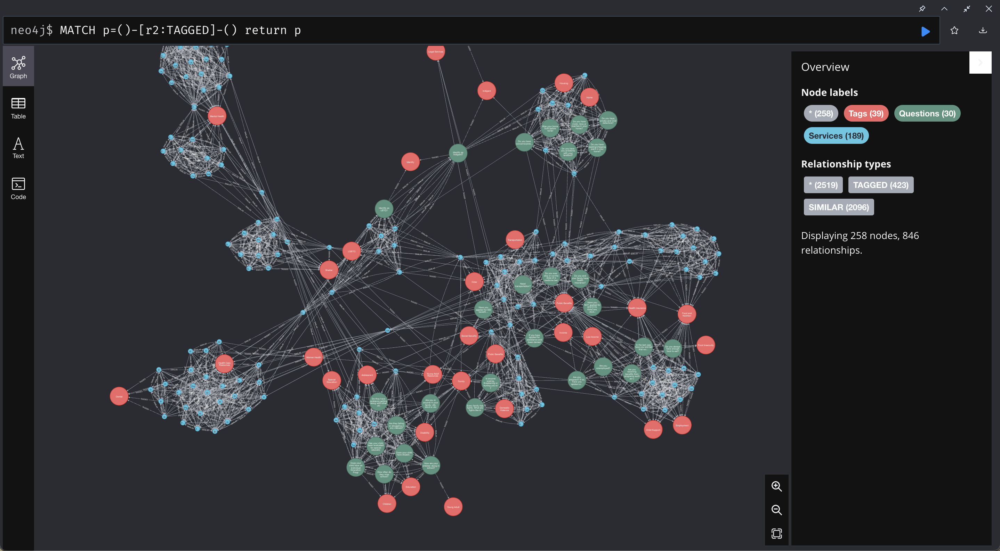

# MHP2NEO
> Importer of Services and Questions to Neo4j Database for further analysis


## Env File
Create a `.env` file with the following parameters:

```bash
NEO_PWD=xxxx
SPACES_KEY_ID=xxxx
SPACES_SECRET=xxxx
SPACES_REGION=xxxx
SPACES_BUCKET=mhpportal
NEO4J_AUTH=neo4j/xxxx
```

## Run Jupyter Lab Locally
```shell
pip install -r requirements.txt
# to run jupyter lab
jupyter lab
```
Run `Spaces_2_Neo.ipynb` to import MHP data to Local Neo4j Database.

## Start Neo4j Docker Container
```shell
docker-compose up -d --build
```

Go to `localhost:7474` to see Neo4j Desktop.



## Next Steps
* Add Scores based on Location
* Add Analytics on How many times question is asked